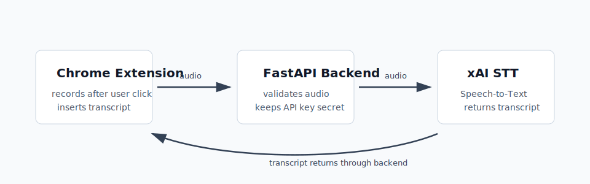
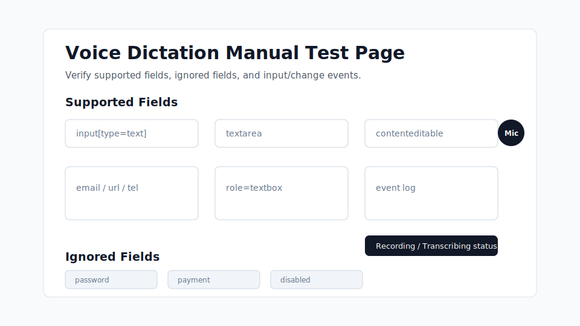

# Voice Dictation Browser Extension

A Chrome browser extension and FastAPI backend for dictating text into web input fields using speech-to-text.



## Architecture

The browser extension will interact with supported page fields, record short audio clips after explicit user action, and send audio to the FastAPI backend. The backend will call xAI Speech-to-Text and return a transcript for insertion into the active field.

The extension must never call xAI directly. API keys belong only on the backend.

## MVP Stack

- Chrome Extension Manifest V3
- Plain JavaScript
- HTML/CSS
- Python FastAPI
- xAI Speech-to-Text API

## MVP Status

The local MVP is working:

- Chrome extension detects supported fields and ignores unsafe fields.
- Mic button records only after explicit user click.
- Extension sends audio to the local FastAPI backend.
- Backend calls xAI Speech-to-Text.
- Transcript is inserted back into the focused field.
- xAI API key stays backend-only in `.env`.
- Backend tests and a local manual QA page are available.

## Local Development

The extension records a short user-triggered clip, sends it to the local FastAPI backend, and inserts the transcript returned by the backend. The backend calls xAI Speech-to-Text using `XAI_API_KEY` from environment variables. The extension must never contain the xAI API key or call xAI directly.

## Quick Start

Clone and enter the project:

```bash
git clone https://github.com/fredjkhar/voice-dictation-extension.git
cd voice-dictation-extension
```

Backend setup:

```bash
cd backend
python3 -m venv .venv
source .venv/bin/activate
pip install -r requirements.txt
cp .env.example .env
```

Set `XAI_API_KEY` in `backend/.env`, then run:

```bash
uvicorn app.main:app --reload
```

Extension setup:

1. Open `chrome://extensions`.
2. Enable Developer mode.
3. Click Load unpacked.
4. Select the `extension/` folder.
5. Reload any test page after loading or reloading the extension.

QA page:

```bash
python3 -m http.server 8080
```

Open:

```text
http://127.0.0.1:8080/qa/manual-test-page.html
```



## Verification

Run backend tests:

```bash
cd backend
source .venv/bin/activate
pytest
```

Run extension syntax checks from the repository root:

```bash
python3 -m json.tool extension/manifest.json >/dev/null
node --check extension/content.js
node --check extension/background.js
node --check extension/popup.js
```

## Troubleshooting

- `502 Bad Gateway`: FastAPI reached xAI but xAI failed or rejected the request. Check backend logs for `xAI STT` warning lines.
- `403` from xAI: the xAI team may need credits or Speech-to-Text access.
- `503`: `XAI_API_KEY` is missing or not loaded by the backend.
- Extension stuck on `Transcribing`: reload the extension in `chrome://extensions`, refresh the page, and retry with a short recording.
- Mic button does not appear: reload the page after loading the extension and focus a supported non-sensitive field.

## Commit Readiness

Before committing:

- Confirm `backend/.env` is not in `git status`.
- Confirm `backend/.venv/`, `__pycache__/`, and `.pytest_cache/` are not in `git status`.
- Run the verification commands above.
- Do not commit real API keys, raw audio, or generated local caches.

## GitHub Project Hygiene

Issue templates are available for:

- Bug reports
- Hardening tasks
- Future feature requests

Use hardening tasks for reliability, privacy, documentation, and QA work. Use feature requests for product scope changes.
